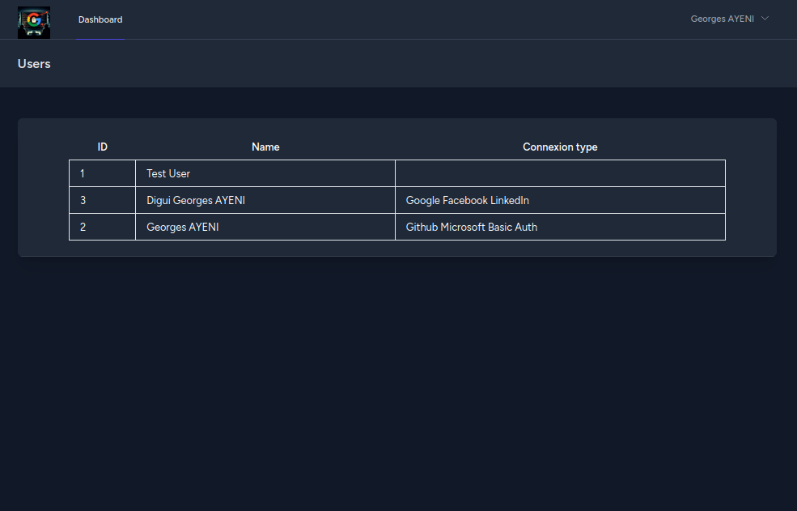

# OAUTH 2

<!-- add video -->

## How it works

1. User clicks on the `Login with Google` button.
2. User is redirected to Google's OAuth 2.0 server.
3. User logs in and approves the permissions requested by the app.
4. User is redirected back to the app with an authorization code.
5. The app exchanges the authorization code for an access token and a refresh token.
6. The app uses the access token to access a Google API.
7. The app can use the refresh token to get a new access token when the current one expires.
8. User logs out.
9. User clicks on the `Login with Google` button again.
10. User is redirected to Google's OAuth 2.0 server.
11. User is already logged in, so Google redirects the user back to the app with a new authorization code.
12. The app exchanges the new authorization code for a new access token and a new refresh token.
13. The app uses the new access token to access a Google API.
14. The app can use the new refresh token to get a new access token when the current one expires.
15. User logs out.

And it the same process for Facebook, Linkedin, etc.

## How to run the app

1. Clone the repository.
2. Run `composer install`.
3. Create a new project in the [Google Developers Console](https://console.developers.google.com/).
4. Create OAuth 2.0 credentials for the project.
5. Add the OAuth 2.0 credentials to the `.env` file.
6. Run `cp .env.example .env`
7. Run `php artisan key:generate`
8. Run `php artisan serve`